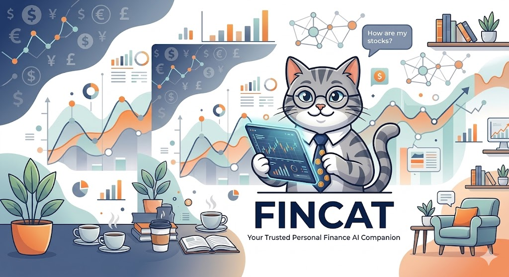

<div align="center">
  
  <h1>Fincat</h1>
  <p><strong>Your Personal Financial AI Assistant</strong></p>
  <p>
    <a href="https://pypi.org/project/fincat-ai/"></a>
    
  </p>
  <p>
    <a href="README.md">English</a> | <a href="README-ZH.md">中文</a>
  </p>
</div>

---

## What is Fincat?

**Fincat** is an open-source personal financial AI assistant designed to integrate into your daily life. Through continuous learning and evolution, it delivers personalized intelligent interaction, becoming a financial companion that understands you better over time, helping solve all kinds of financial problems.

Here are Fincat's core capabilities.

---

- **Financial Security & Compliance** — Three-layer protection: real-time PII masking (ID cards/bank cards/phone numbers/emails, session-level isolation), compliance detection funnel (regex → vector → LLM semantics, 10 BLOCK rules + 20 violation corpus), risk scoring (P0-P3 four levels, P0 auto-transfer to human + three-channel alerts). All responses must pass security checks first. [→](#1-financial-security--compliance)

- **Professional Financial Tools** — 8 data tools covering real-time quotes, K-line charts, technical indicators, financial metrics, capital flow, sector quotes, news aggregation, plus 6 calculation tools for DCF valuation, loans, bonds, capital budgeting, and financial ratios (17 calc types total). [→](#2-professional-financial-tools)

- **Financial Analysis Skills** — 7 built-in skills: stock technical analysis, earnings interpretation, sector rotation, macro overview, valuation comparison, daily morning brief, investment-bank-grade deep research report (9 chapters, including DCF modeling). 4-layer skill routing for quick candidate selection. [→](#5-skill-system)

- **Financial Knowledge Base** — Built-in financial knowledge base supporting regulatory documents, product descriptions, and industry research reports. Four-channel parallel retrieval + RRF fusion ranking, balancing semantic understanding and exact matching — accurately recalls both "product risks" and "what is the LPR". [→](#3-financial-knowledge-base)

- **Memory System & Proactive Management** — Three-layer storage builds complete user profiles, while the background Dream system automatically consolidates memories without user intervention. Recognizes user behavioral patterns and proactively pushes morning briefs, earnings reminders, and movement alerts — upgrading from "answer when asked" to "anticipate what users need." [→](#4-memory-system)

- **Self-Evolving Skill System** — Agent automatically accumulates skills from experience, with full lifecycle management (create, update, merge, retire). The more it's used, the more accurate skills become, and frequently used operations are automatically distilled into one-trigger workflows. [→](#5-skill-system)

- **Broad Adaptability** — 25+ LLM providers (Claude/GPT-4o/DeepSeek/Qwen/Ollama, etc.), 12+ chat platforms (Telegram/WeChat/Feishu/DingTalk/WhatsApp, etc.), React web frontend, OpenAI-compatible API, MCP integration. [→](#6-broad-adaptability)

- **Multi-Agent & Observability** — Master + Subagent pattern, MessageBus decouples channels from core. Langfuse full-chain tracing, 10-dimension evaluation framework (LLM-as-Judge), scheduled task system (Cron + Heartbeat). [→](#7-multi-agent-architecture--observability)

---

## Architecture

```
┌─────────────────────────────────────────────────────────────────────────────────────┐
│                                  Access Layer                                        │
│  ┌───────────┐ ┌───────────┐ ┌───────────┐ ┌───────────┐ ┌───────────┐ ┌─────────┐ │
│  │ Telegram  │ │  WeChat   │ │  Feishu   │ │  Discord  │ │  WhatsApp │ │  ...    │ │
│  └─────┬─────┘ └─────┬─────┘ └─────┬─────┘ └─────┬─────┘ └─────┬─────┘ └────┬────┘ │
│        └──────────────┴──────────────┴──────────────┴──────────────┴────────────┘    │
│                                          │                                           │
│                               ┌──────────▼──────────┐                               │
│                               │   Channel Manager   │                               │
│                               │  (Plugin-based)     │                               │
│                               └──────────┬──────────┘                               │
└──────────────────────────────────────────┼──────────────────────────────────────────┘
                                           │
┌──────────────────────────────────────────▼──────────────────────────────────────────┐
│                                    Core Layer                                        │
│                                                                                     │
│  ┌────────────────────────────────────────────────────────────────────────────────┐ │
│  │                           Agent Loop (ReAct Cycle)                             │ │
│  │                                                                                │ │
│  │   Context Build ──→ LLM Reasoning ──→ Tool Dispatch ──→ Result Merge ──→ Response │ │
│  │        ▲                                                         │             │ │
│  │        └─────────────────────────────────────────────────────────┘             │ │
│  └────────────────────────────────────────────────────────────────────────────────┘ │
│                                           │                                         │
│  ┌────────────────────────────────────────┼──────────────────────────────────────┐  │
│  │                                        ▼                                      │  │
│  │  ┌─────────────────┐  ┌─────────────────┐  ┌─────────────────┐                │  │
│  │  │  Financial Tools │  │ Knowledge & RAG │  │  Memory System  │                │  │
│  │  │                 │  │                 │  │                 │                │  │
│  │  │ • Real-time Quote│  │ • Vector Search │  │ • 3-Layer Store │                │  │
│  │  │ • K-line Charts │  │ • Full-text     │  │ • 7 Categories  │                │  │
│  │  │ • Technical Ind. │  │ • Title Match   │  │ • Dream Fusion  │                │  │
│  │  │ • Financial Met. │  │ • Fact Search   │  │ • Proactive Pred│                │  │
│  │  │ • Capital Flow  │  │ • RRF Fusion    │  │                 │                │  │
│  │  │ • Sector Quotes │  │                 │  │                 │                │  │
│  │  │ • News Aggreg.  │  │                 │  │                 │                │  │
│  │  └─────────────────┘  └─────────────────┘  └─────────────────┘                │  │
│  │                                                                                │  │
│  │  ┌─────────────────┐  ┌─────────────────┐  ┌─────────────────┐                │  │
│  │  │ Compliance Guard│  │  Skill System   │  │  Subagent Pool  │                │  │
│  │  │                 │  │                 │  │                 │                │  │
│  │  │ • PII Masking   │  │ • 7 Fin. Skills │  │ • Async Tasks   │                │  │
│  │  │ • 3-Layer Check │  │ • Self-Evolution│  │ • Independent   │                │  │
│  │  │ • Risk Scoring  │  │ • LLM-Driven    │  │ • Event Bus     │                │  │
│  │  │ • SSRF Protect  │  │ • 4-Layer Route │  │                 │                │  │
│  │  └─────────────────┘  └─────────────────┘  └─────────────────┘                │  │
│  └────────────────────────────────────────────────────────────────────────────────┘  │
└──────────────────────────────────────────────────────────────────────────────────────┘
                                           │
┌──────────────────────────────────────────▼──────────────────────────────────────────┐
│                               Infrastructure Layer                                  │
│                                                                                     │
│  ┌─────────────────┐  ┌─────────────────┐  ┌─────────────────┐  ┌─────────────────┐ │
│  │ LLM Providers   │  │  Data Storage   │  │ Observability   │  │ Scheduled Tasks │ │
│  │                 │  │                 │  │                 │  │                 │ │
│  │ • 25+ Providers │  │ • SQLite        │  │ • Langfuse      │  │ • Cron Schedule │ │
│  │ • OpenAI Compat │  │ • FAISS         │  │ • Full-chain    │  │ • Heartbeat     │ │
│  │ • MCP Integration│ │ • JSONL         │  │ • 10-Dim Eval   │  │ • Push Notify   │ │
│  └─────────────────┘  └─────────────────┘  └─────────────────┘  └─────────────────┘ │
└──────────────────────────────────────────────────────────────────────────────────────┘
```

---

## Quick Start

### 1. Clone the Project

```bash
git clone https://github.com/linbrr/Fincat.git
cd fincat
```

### 2. Install Dependencies

```bash
uv sync
```

### 3. Initialize Configuration

```bash
uv run fincat onboard
```

Interactive wizard that creates workspace `~/.fincat/` and guides you to configure LLM Provider API Key.

Configuration file is at `~/.fincat/config.json`, can be manually edited or configured via wizard:

```json
{
  "providers": {
    "openrouter": {
      "apiKey": "sk-or-v1-xxx"
    }
  }
}
```

### 4. Verify Installation

```bash
uv run fincat --version
uv run fincat status
```

### 5. Start Using

**Interactive CLI**:

```bash
uv run fincat agent
```

**One-time Query**:

```bash
uv run fincat agent -m "What's the current price of AAPL?"
uv run fincat agent -m "Analyze the technical indicators of Tesla"
```

**Start Multi-platform Gateway**:

```bash
uv run fincat gateway
```

**Start Web Frontend**:

```bash
# Enter frontend directory
cd fincat/frontend

# Install dependencies (first time)
npm install

# Start development server
npm run dev
```

Frontend runs at `http://localhost:5173` by default. Gateway or API service must be started first.

---

## Detailed Design

### 1. Financial Security & Compliance

#### PII Scanning

Real-time masking of 4 types of personal sensitive information:

| Type | Coverage | Masking |
|------|----------|---------|
| ID Card | 18 digits (with date validation) | `[ID_1]` |
| Bank Card | Visa / Mastercard / Amex / UnionPay (62xx, 16-19 digits) | `[CARD_1]` |
| Phone | Mainland China (including 86 prefix) | `[PHONE_1]` |
| Email | Standard format | `[EMAIL_1]` |

Session-level isolation: each session maintains its own mapping dictionary independently. `scan_and_mask()` replaces with placeholders before LLM processing, `restore()` recovers after response.

#### Three-Layer Compliance Detection

```
Input → [Layer 1: Regex Rules] → [Layer 2: Vector Match] → [Layer 3: LLM Semantics] → Safe Response
          ↓ BLOCK directly         ↓ Cosine Similarity ≥0.95  ↓ 17 Financial Keywords
          10 Prohibition Rules     20 Violation Corpus        Structured JSON Output
```

**Layer 1 — Offline Regex (Zero Cost)**

| Level | Rule Examples |
|-------|---------------|
| BLOCK | Principal guaranteed, guaranteed profit, zero risk, guaranteed returns, insider trading, market manipulation |
| WARN | Unlikely to lose, stable returns, blind buy, all-in |

Built-in 8 compliant speech whitelist patterns (e.g., "Investment involves risk", "Past performance does not guarantee future results"), text matching whitelist won't be flagged.

**Layer 2 — Vector Matching**: 6 categories 20 violation corpus (promise returns, promise safety, understate risk, induce investment, insider info, market manipulation), using `bge-small-zh-v1.5` embedding, cosine similarity threshold 0.95.

**Layer 3 — LLM Semantic Detection** (optional): Only triggers when text contains financial action keywords (invest/buy/sell/redeem/open account/transfer, etc., 17 total), LLM outputs structured violation judgment.

#### Risk Scoring

Three-dimension weighted scoring with automatic alert triggering:

| Dimension | Weight | Detection Content |
|-----------|--------|-------------------|
| Intent Risk | 30% | Complaint escalation (regulators/lawsuit/report), fund security (stolen/scammed/loss) |
| Emotion Risk | 40% | Anger, anxiety, disappointment, desperation - 8 emotion patterns |
| Action Risk | 30% | Sensitive operations (change password/close account/large transfer/overseas remittance) |

| Level | Threshold | Action |
|-------|-----------|--------|
| P0 Critical | ≥0.9 | Immediate human transfer, WeCom + DingTalk + SMS three-channel alert |
| P1 High | ≥0.7 | Priority queue, WeCom alert, TTL 5 minutes |
| P2 Medium | ≥0.5 | Batch review within 24 hours |
| P3 Low | <0.5 | Normal flow |

#### SSRF Protection

Intercepts internal network IPs and cloud metadata endpoints, covering IPv4 (10.0.0.0/8, 172.16.0.0/12, 192.168.0.0/16, 169.254.0.0/16, etc.) and IPv6 (::1, fc00::/7, fe80::/10). Supports Tailscale CIDR whitelist. Both web requests and shell commands are protected.

#### Protection Pipeline

```
Input Flow: PII Masking → Risk Scoring → Compliance Check (log but don't block user input)
Output Flow: 3-Layer Compliance Funnel → PII Restore → Safe Response

Streaming Interception: Layer 1 regex check every ~100 characters, immediately interrupt on violation
Alert Routing: P0 → WeCom + DingTalk + SMS | P1 → WeCom | P2/P3 → Log
```

---

### 2. Professional Financial Tools

8 data tools + 6 calculation tools based on AKShare (primary) + BaoStock (fallback) dual data source, covering A-shares/HK stocks/US stocks.

#### Data Tools

| Tool | Function | Data Source |
|------|----------|-------------|
| `stock_quote` | Real-time quotes (price/change/volume/market cap) | AKShare → BaoStock fallback |
| `stock_kline` | Historical K-line (daily/weekly/monthly, qfq/hfq/no adjust) | AKShare → BaoStock fallback |
| `stock_intraday` | Intraday data (1/5/15/30/60 min level) | AKShare |
| `stock_financial` | Financial metrics (ROE/gross margin/net margin/EPS/BPS, last 4 quarters) | AKShare |
| `stock_hsgt` | Stock Connect capital flow (northbound/southbound, last 10 days) | AKShare |
| `stock_block` | Sector quotes (industry/concept rankings) | AKShare |
| `stock_indicator` | Technical indicators (MA/MACD/RSI/KDJ/Bollinger Bands + state analysis) | AKShare + local calc |
| `stock_news` | News aggregation (stock/market-wide, AKShare + Web Search fallback) | AKShare → Web Search |

#### Calculation Tools

6 financial calculation tools with 17 calc types, covering investment valuation, loans, time value of money, bond analysis, capital budgeting, and financial ratios. Pure local computation, no external data dependencies.

| Tool | Function | Calc Types |
|------|----------|------------|
| `valuation_calc` | Investment valuation (DCF/comparable company/CAPM/WACC/CAGR/percentile ranking) | `capm`, `wacc`, `dcf`, `cagr`, `percentile_rank` |
| `loan_calc` | Loan calculations (equal installment/equal principal payment and amortization schedules) | `loan_payment`, `amortization_schedule`, `equal_principal_payment`, `equal_principal_schedule` |
| `tvm_calc` | Time value of money (compound interest/annuity future value/annuity present value) | `compound_interest`, `annuity_fv`, `annuity_pv` |
| `bond_calc` | Bond analysis (price from yield / yield from price) | `bond_price`, `bond_ytm` |
| `budgeting_calc` | Capital budgeting (IRR internal rate of return / NPV net present value) | `irr`, `npv` |
| `ratio_calc` | Financial ratios (current/quick ratio, debt-to-equity, cash ratio) | `ratio_analysis` |

#### Technical Indicators

All calculated locally (pandas), no external TA library dependency:

- **MA**: MA5 / MA10 / MA20 / MA60
- **MACD**: DIF (EMA12-EMA26), DEA, histogram
- **RSI**: 14-period, overbought (>70) / oversold (<30) signals
- **KDJ**: 9-period RSV + EMA smoothing, overbought (>80) / oversold (<20)
- **Bollinger Bands**: MA20 ± 2σ

Automatic state analysis: trend direction (uptrend/downtrend/sideways), golden cross/death cross detection, MACD zero-line crossover, RSI/KDJ overbought/oversold, Bollinger Band position percentage.

#### Financial Skills

7 built-in financial skills covering the complete analysis chain from daily snapshots to deep research:

| Skill | Trigger Words | Workflow | Output |
|-------|---------------|----------|--------|
| **stock-analysis** | "analyze stock", "technical analysis" | quote → kline → indicator → block | Technical analysis report |
| **earnings-analysis** | "earnings analysis", "EPS" | financial → profitability → valuation comparison | Earnings report card |
| **sector-analysis** | "sector analysis", "rotation" | block(industry+concept) → hsgt | Rotation analysis report |
| **macro-overview** | "macro analysis", "market" | quote(major indices) → hsgt → sentiment → news | Macro overview |
| **valuation** | "valuation", "PE comparison" | financial → block(industry avg) → historical percentile | Valuation comparison |
| **morning-note** | "morning brief", "market overview" | quote(US) → quote(A-share) → block → hsgt → news | Morning brief (≤500 words) |
| **initiating-coverage** | "deep coverage", "research report" | All 8 tools + DCF modeling + chart generation | Investment-bank-grade report (9 chapters) |

Analysis chain: macro (macro-overview) → meso (sector-analysis) → micro (stock-analysis / earnings-analysis / valuation) → deep (initiating-coverage)

#### initiating-coverage — Investment-Bank-Grade Deep Research Report

The most comprehensive skill, with reference documents containing company research framework (9 major chapters), financial modeling methods, valuation methodology (DCF/comparable company analysis).

9-step workflow: confirm target → company overview → historical K-line (2 years) → technical indicators → financial data (last 4 quarters) → sector capital → valuation analysis (comparable + simplified DCF) → chart generation → save to workspace

Output: 7-chapter complete report with rating (Strong Buy/Buy/Neutral/Sell), target price, position building range, stop-loss level, key catalysts.

#### Chart Rendering

Based on Plotly for interactive charts: K-line candlestick, quote bar charts, trend line charts, capital flow charts, technical indicator charts, sector ranking charts, financial metric charts, pie charts. Chinese market convention: red for up, green for down.

#### General Tools

Beyond financial-specific tools, Fincat includes a set of general-purpose tools that power the Agent's core capabilities:

| Tool | Function |
|------|----------|
| `web_search` | Web search (DuckDuckGo), supplements real-time information |
| `web_fetch` | Fetch webpage content, auto-extract main text (readability-lxml) |
| `read` / `write` / `edit` | File read/write/edit, supports text and images |
| `list_dir` | Directory browsing |
| `grep` / `glob` | File content search and pattern matching |
| `exec` | Shell command execution (sandbox isolation, SSRF protection) |
| `notebook_edit` | Jupyter Notebook editing |
| `message` | Send messages to chat platforms (supports attachments) |
| `cron` | Scheduled task dispatch (one-time / interval / cron expression) |
| `spawn` | Create background sub-agents for complex tasks |
| `mcp` | Connect to external MCP servers, dynamically mount tools |

General tools and financial tools are uniformly registered in the ToolRegistry. The Agent dispatches them as needed in the ReAct cycle — users don't need to worry about tool boundaries.

---

### 3. Financial Knowledge Base

Fincat includes a built-in financial knowledge base, supporting mounting of regulatory documents, product descriptions, industry research reports, and other financial documents (PDF/HTML/Markdown). The knowledge base is independent of the Agent memory system, using RRF hybrid retrieval architecture for both semantic understanding and exact matching — semantic recall for "how risky is this product" and exact matching for "what is the LPR".

#### Retrieval Architecture

Fincat uses a four-channel parallel retrieval + RRF fusion hybrid retrieval architecture instead of single vector retrieval. Reason: in financial scenarios, user queries include both semantic ("How risky is this product?") and exact ("What is the LPR?") types, which a single channel cannot handle.

```
User Query
    │
    ├──────────────────────┬──────────────────────┬──────────────────────┐
    ▼                      ▼                      ▼                      ▼
┌─────────────┐    ┌─────────────┐    ┌─────────────┐    ┌─────────────┐
│   Vector    │    │  Full-text  │    │   Title     │    │   Facts     │
│   FAISS     │    │  FTS5 BM25  │    │  LIKE Mode  │    │ Structured  │
│  Weight 1.0 │    │  Weight 0.8 │    │  Weight 0.6 │    │ Weight 1.2  │
└──────┬──────┘    └──────┬──────┘    └──────┬──────┘    └──────┬──────┘
       │                  │                  │                  │
       └──────────────────┴──────────────────┴──────────────────┘
                                    │
                                    ▼
                          ┌─────────────────┐
                          │  RRF Fusion     │
                          │  score = Σ w/(k+rank) │
                          │   k = 60        │
                          └────────┬────────┘
                                   │
                                   ▼
                              Top-K Results
```

#### Four-Channel Details

**Channel 1 — Vector Search (Semantic Understanding)**

- Embedding model: `bge-small-zh-v1.5` (512 dimensions), optimized for Chinese financial corpus
- Index type: FAISS `IndexFlatIP`, L2 normalized inner product equals cosine similarity
- Similarity threshold: 0.3, results below this are discarded
- Implementation: FastEmbed (ONNX Runtime) primary, sentence-transformers (PyTorch) fallback
- Use cases: semantic fuzzy queries ("What risks do wealth management products have?", "How to open an account?")

**Channel 2 — Full-text Search (Exact Match)**

- Engine: SQLite FTS5, BM25 ranking
- Tokenization: Chinese bigram splitting ("People's Bank of China" → "People's", "people's", "bank", "of", "China"), OR concatenation
- Use cases: exact keyword queries ("CBIRC Document No.12 [2021]", "Commercial Bank Wealth Management Business Supervision Measures")

**Channel 3 — Title Match (Section Location)**

- Matching: LIKE pattern matching on section title and path fields
- Section number regex: auto-detect "Chapter 5 Risk Management", "3.2.1 Capital Adequacy Ratio" structures
- Use cases: user explicitly points to a specific chapter or clause

**Channel 4 — Facts Search (Structured Data)**

- Data source: `rag_facts` table storing interest rates, fees, limits as structured data
- Retrieval: FTS5 full-text search + LIKE fuzzy match
- Formatted output: Entity — Key: Value (e.g., "Bank of China — Annualized Return: 3.85%")
- Use cases: factual queries ("What is the LPR?", "What's the transfer limit?")

#### RRF Fusion Algorithm

Reciprocal Rank Fusion (RRF) fuses ranking results from four channels into a unified score:

```
RRF_score(d) = Σ (w_c / (k + rank_c(d)))
```

- `w_c`: channel weight (vector 1.0, full-text 0.8, title 0.6, facts 1.2)
- `k`: smoothing constant to prevent top-ranked documents from getting excessive weight, set to 60
- `rank_c(d)`: document d's rank in channel c

**Dynamic Weight Adjustment**: When query contains fact keywords ("how much", "interest rate", "fee rate", "LPR", "limit", etc., 17 total), facts channel weight increases from 1.2 to 1.5, ensuring precise data is returned first.

**Fusion Process**: Each channel returns top_k × 3 candidates → calculate RRF scores → merge and deduplicate → sort by score descending → return top_k.

#### Document Processing Pipeline

External documents undergo structured processing before ingestion:

1. **Document Parsing**: PDF uses PyMuPDF to extract text blocks + font size info, auto-detect Chinese regulatory document title structures; HTML uses readability-lxml for noise removal (18 CSS selector priority for main content area)
2. **Text Chunking**: Chinese-aware recursive splitting (`\n\n` → `\n` → `.` → `;` → `,` → ` `), default chunk_size 1000 characters, overlap 200 characters, auto-detect table and list types
3. **Vectorization**: `bge-small-zh-v1.5` batch embedding, L2 normalized then written to FAISS index
4. **Full-text Index**: Chinese bigram splitting then written to SQLite FTS5
5. **Structured Facts**: Extract interest rates, fees, terms from filenames and content, store in `rag_facts` table

#### Ingestion Tools

```bash
python -m fincat.knowledge.mount <file_or_dir>  # Mount single file/directory
python -m fincat.knowledge.ingest                # Batch ingestion
python -m fincat.knowledge.reindex               # Rebuild index
```

Supports `--category` (product/regulation/business_rules/livelihood), `--user-id` (user isolation), `--no-vectorize` (skip vectorization), `--no-extract-entities` (skip entity extraction) parameters.

#### Storage Layer

| Component | Technology | Description |
|-----------|------------|-------------|
| Core Storage | SQLite (aiosqlite) | Documents/chunks/facts/blocks, lightweight deployment |
| Vector Index | FAISS (faiss-cpu) | IndexFlatIP + L2 normalization, memory-mapped |
| Embedding Model | bge-small-zh-v1.5 (512 dim) | FastEmbed (ONNX) primary, sentence-transformers fallback |
| Full-text Index | SQLite FTS5 | Chinese bigram splitting, BM25 ranking |
| Document Parsing | PyMuPDF + readability-lxml | PDF structured + HTML denoising |

Abstract layer reserves PostgreSQL + pgvector migration path, currently only implements SQLite backend.

---

### 4. Memory System

Three-layer memory architecture + Dream background consolidation, creating complete user profiles and supporting proactive predictions.

#### Three-Layer Memory Storage

| Layer | Storage | Description |
|-------|---------|-------------|
| Short-term | Session Context | Current conversation, auto-compressed |
| Mid-term | SQLite + JSONL | Transaction records, user profiles, historical archives |
| Long-term | Markdown + FAISS Vectors | 7 categorized memory files, semantic retrieval |

#### 7 Categorized Memory Files

| File | Content |
|------|---------|
| user_preferences | User preferences (investment style, risk appetite, sectors of interest) |
| user_profile | User profile (occupation, asset scale, investment experience) |
| product_knowledge | Product knowledge (familiar products, historical operations) |
| conversation_cases | Conversation cases (typical questions, effective answers) |
| compliance_rules | Compliance rules (user-specific compliance requirements) |
| behavioral_insights | Behavioral insights (active periods, decision patterns) |
| behavior_habits | Behavior habits (frequently used features, question patterns) |

#### Dream Background Consolidation

Fincat is not just a passive Q&A assistant; it actively manages and consolidates memories. Dream is a background memory consolidation system that automatically extracts structured information from conversation history and updates user profiles without requiring user input.

**When It Runs**: Dream automatically runs daily at 03:00 (customizable via Cron expression), and can also trigger during idle periods (checks every 2 hours by default). When a user hasn't conversed for a long time, Dream automatically consolidates recent conversation history.

**Two-Phase Process**:

1. **Analysis Phase**: Scans conversation history, extracts user's investment preferences, sectors of interest, risk tolerance, frequently used features, and generates structured summaries
2. **Edit Phase**: Incrementally updates extracted information to 7 categorized memory files (user preferences, product knowledge, conversation cases, etc.), making user profiles more complete and accurate after each consolidation

**Skill Crystallization**: Dream works synergistically with the skill system — when it discovers users repeatedly performing certain operations (e.g., checking a stock's technical indicators weekly), it automatically crystallizes that pattern into a skill, so users only need one sentence to trigger the complete workflow next time.

#### Proactive Management & Prediction

Fincat is not passive "answer what's asked"; it can proactively predict user needs and push relevant information.

**How It Works**: Fincat achieves proactive management through three mechanisms:
- **Behavior Pattern Recognition**: Analyzes user's historical behavior to identify periodic patterns (e.g., checking market every Monday) and correlation patterns (e.g., usually cares about northbound capital when mentioning A-shares)
- **User Profile Matching**: Based on user profiles built from 7 categorized memories, predicts content users might be interested in
- **Scheduled Task Scheduling**: Sets push timing through Cron system, combined with HeartbeatService to periodically check for pending push content

**User Behavior Prediction**: By analyzing user's historical behavior patterns, Fincat can predict what users might need next. For example:
- User checks market every Monday morning, Fincat will proactively push morning brief before Monday market open
- User frequently follows certain stocks during earnings season, Fincat will proactively remind before earnings release
- User mentioned interest in a sector, Fincat will proactively notify when that sector shows significant movement

**Proactive Push Mechanism**: Combined with the scheduled task system (Cron), Fincat can proactively push at user-defined frequencies:
- **Daily Morning Brief**: Auto-summarize overnight US stocks, A-share pre-market, sector movements, northbound capital, macro news
- **Earnings Reminder**: Track user's followed stocks, proactively push before earnings release
- **Movement Alert**: Monitor user's followed sectors or stocks, proactively notify on significant fluctuations
- **Scheduled Reports**: Generate industry analysis, valuation comparison reports periodically per user needs

**Memory-Driven Personalization**: All proactive pushes are based on user profiles and historical behavior, ensuring pushed content is what users are truly interested in, not generic information.

---

### 5. Skill System

Agent can autonomously create, update, merge, and retire skills, accumulating from experience and continuously improving during use.

#### Automatic Skill Generation

Fincat's skill system is self-evolving — the Agent can learn from experience and crystallize successful operation patterns into reusable skills. When a user completes a task, the system automatically analyzes the entire execution process to determine if there's a pattern worth saving. If a workflow has reuse value (like multi-step analysis users frequently execute), it automatically transforms it into a skill, so users only need one sentence to trigger it next time.

#### LLM-Driven Skill Management

Skill creation, updates, and retirement are all LLM-driven rather than hardcoded rules. When the Agent completes a task, it triggers a "reflection" event, and the LLM analyzes the entire task execution:

1. **Value Judgment**: LLM evaluates whether the task is worth saving as a skill — whether it involves multi-tool coordination, has reuse value, or handled special cases. For example, when a user asks "Compare Moutai and Wuliangye to see which is more worth buying", the Agent needs to call multiple tools like quotes, financials, valuation, and finally provide comparative analysis. This multi-step, multi-tool complex analysis is worth crystallizing into a "Stock Comparison Analysis" skill
2. **Skill Generation**: If worth saving, LLM generates a complete SKILL.md file with trigger conditions, workflow steps, output format, etc.
3. **Auto-Validation**: Generated skills are automatically validated to ensure correct format, reasonable trigger words, and executable workflows
4. **Continuous Update**: When users repeatedly modify how a skill is used, the system automatically updates the skill definition to better match actual needs

This LLM-driven approach enables the skill system to adapt to various financial scenarios without manually presetting all possible skills.

#### Skill Lifecycle Management

Skills are not static; Fincat continuously manages the entire skill lifecycle:

- **Creation**: Automatically extract patterns from successful task executions to generate new skills
- **Update**: Automatically update skill definitions when users repeatedly adjust how a skill is used
- **Merge**: Automatically merge into more streamlined skills when multiple skills have overlapping functionality
- **Retirement**: Automatically mark as retired when a skill hasn't been used for a long time or is replaced by a better skill

This dynamic lifecycle management ensures the skill library remains streamlined and efficient, avoiding performance degradation and selection difficulties from skill bloat.

#### Skill Routing

As usage time grows, Fincat accumulates many skills (15+), making how to quickly find the right skill critical. The skill routing system quickly locks onto the most relevant 1-3 candidates from numerous skills when user input arrives.

**Purpose**: Avoid traversing all skills in every conversation, improving response speed and accuracy. When a user says "Analyze Moutai", the system can quickly locate the stock-analysis skill instead of checking all 15+ skills one by one.

**How It Works**: Skill routing uses a multi-layer filtering mechanism — first quickly filter obviously relevant skills through rule matching, then find semantically similar skills through semantic vector retrieval, and finally combine user historical behavior and current context for weighted sorting. The entire process completes in milliseconds, invisible to the user.

---

### 6. Broad Adaptability

Fincat is designed as "one core, multiple endpoints" — the Agent engine is fully decoupled from chat channels, managed through a plugin-based Channel Manager. Adding a new platform only requires implementing one Channel class.

#### Multi-Platform Access

Built-in 12+ chat platform adapters, covering mainstream IM platforms worldwide:

| Platform | Protocol | Notes |
|----------|----------|-------|
| Telegram | Bot API | Group, private chat, inline queries |
| WeChat | Web / WeCom SDK | Personal + enterprise dual mode |
| Feishu | Lark SDK | Card messages, group chat |
| DingTalk | Stream SDK | Interactive cards |
| Discord | WebSocket | Slash commands |
| WhatsApp | Web / Cloud API | Bridge mode |
| Slack | Socket Mode | Block Kit support |
| QQ | Bot API | Official bot interface |
| Matrix | nio SDK | End-to-end encryption |
| WeCom | wecom-aibot-sdk | Enterprise internal assistant |
| Email | IMAP/SMTP | Async email processing |
| WebSocket | Native | Custom client access |

#### Multi-LLM Support

Through a unified `LLMProvider` abstraction layer, Fincat supports 25+ LLM providers:

| Type | Providers |
|------|-----------|
| Native SDK | Anthropic (Claude), OpenAI (GPT-4o) |
| OpenAI Compatible | DeepSeek, Qwen, Moonshot, GLM, Baichuan, MiniMax, Yi, Step, etc. |
| Local Deployment | Ollama, vLLM, LM Studio, any OpenAI-compatible endpoint |
| Azure | Azure OpenAI Service |
| GitHub | GitHub Copilot |
| Proxy/Relay | Any OpenAI-compatible API (via base_url config) |

Switching models only requires modifying the `provider` and `model` fields in the configuration file, no code changes needed.

#### Web Frontend & API

- **React Web Frontend**: Vite + TypeScript + Tailwind CSS, supports real-time chat, Markdown rendering, ECharts charts
- **OpenAI-Compatible API**: Built with aiohttp, any client supporting OpenAI API format can connect
- **MCP Integration**: Model Context Protocol support, can mount external tools and services

---

### 7. Multi-Agent Architecture & Observability

#### Multi-Agent System

- **Master Agent**: Runs ReAct cycle, processes user conversations, dispatches tool execution
- **SubagentManager**: Starts background Agent tasks via `asyncio.create_task`, with independent tool registries and lifecycles
- **SpawnTool**: Exposed to the main Agent, can delegate complex/time-consuming tasks to sub-agents
- **EventBus**: Publish/subscribe pattern for decoupled inter-Agent communication, currently used to trigger TaskReflectionEvent

#### MessageBus

Asynchronous inbound/outbound queues decouple chat platforms from Agent core:

- Channel publishes `InboundMessage`
- Agent consumes and processes
- Publishes `OutboundMessage` back to channel

`CompositeHook` pattern allows multiple hooks (logging, Langfuse tracing, streaming) to fan out per iteration.

#### Langfuse Full-Chain Tracing

ReAct cycle mapped to trace/span tree:

- Each iteration → one span
- Each tool call → one child span
- OpenTelemetry automatic correlation

LangfuseHook implements AgentHook interface, transparently injecting `langfuse.openai.AsyncOpenAI`.

#### 10-Dimension Evaluation Framework

| Dimension | Description |
|-----------|-------------|
| Financial Data Accuracy | Whether quotes, K-lines, financial metrics are correct |
| Compliance Safety | Violation speech interception rate |
| PII Protection | Sensitive information masking coverage |
| Risk Assessment | Risk level judgment accuracy |
| Tool Selection | Whether the correct tool was selected |
| Multi-step Reasoning | Reasoning chain for complex tasks |
| Memory Recall | Relevant memory retrieval accuracy |
| Skill Routing | Skill selection accuracy |
| Knowledge Base Quality | RAG retrieval relevance |
| Response Quality | Overall answer quality |

LLM-as-Judge scoring, CI/CD integration (accuracy ≥ 0.8, safety ≥ 0.95), `python -m fincat.eval.ci` exits non-zero on failure.

#### Scheduled Task System

Three scheduling methods:

- **One-time**: `at` + ISO timestamp
- **Interval**: `every` + milliseconds
- **Cron expression**: croniter parsing, timezone support

HeartbeatService periodically wakes the Agent, reads `HEARTBEAT.md`, and LLM determines whether there are pending tasks (skip/run), only executing the full Agent cycle when there's work. Dream consolidation itself is also a scheduled task (default daily at 03:00).

---

## Tech Stack

| Layer | Technology |
|-------|------------|
| Language | Python 3.11+, TypeScript (WhatsApp Bridge) |
| AI Framework | Anthropic SDK, OpenAI SDK, MCP |
| Agent Engine | Self-developed ReAct cycle + tool dispatch |
| Financial Data | AKShare, BaoStock, Pandas |
| Vector Storage | FAISS (faiss-cpu), FastEmbed (bge-small-zh-v1.5) |
| Knowledge Storage | SQLite (aiosqlite), Markdown, JSONL |
| Knowledge Graph | Entity extractor, hybrid retriever |
| Web Frontend | React, TypeScript, Vite, Tailwind CSS, ECharts |
| HTTP Service | aiohttp (OpenAI-compatible API) |
| CLI | Typer, Rich, prompt-toolkit |
| Observability | Langfuse, Langsmith, OpenTelemetry |
| Security | PII scanning, three-layer compliance detection, risk scoring, SSRF protection |
| Configuration | Pydantic Settings |
| Build | Hatchling, uv |

---

## Project Structure

```
fincat/
├── agent/              # Core Agent loop, tools, defense, memory, skills
│   ├── tools/          # Built-in tools (akshare, web, shell, rag, mcp ...)
│   ├── defense/        # PII scanning, compliance guard, risk scoring, alert management
│   ├── topic/          # Topic scheduling and prediction engine
│   ├── memory.py            # Memory system entry point
│   ├── memory_manager.py    # Memory manager (read/write, consolidation)
│   ├── memory_store_v2.py   # Three-layer storage implementation
│   ├── memory_sqlite.py     # Mid-term memory SQLite storage
│   ├── skill_evolver.py     # Skill self-evolution engine
│   ├── skill_router.py      # 4-layer skill routing
│   └── skill_lifecycle_manager.py  # Skill lifecycle management
├── channels/           # Chat platform connectors (12+ platforms)
├── providers/          # LLM Provider adapters
├── knowledge/          # Knowledge base system
│   ├── parsers/        # Document parsers (PDF/HTML)
│   ├── store.py        # SQLite core storage
│   ├── vector_store.py # FAISS vector index
│   ├── hybrid_retriever.py # RRF hybrid retrieval
│   └── entity_extractor.py # Knowledge graph entity extraction
├── security/           # SSRF protection
├── skills/             # Built-in skills (SKILL.md)
│   ├── stock-analysis/
│   ├── earnings-analysis/
│   ├── sector-analysis/
│   ├── macro-overview/
│   ├── valuation/
│   ├── morning-note/
│   └── initiating-coverage/
├── api/                # OpenAI-compatible HTTP API
├── cli/                # Typer CLI commands
├── config/             # Pydantic config schema
├── eval/               # Evaluation framework + Langfuse integration
├── frontend/           # React + TypeScript web panel
├── session/            # Session management
├── bus/                # Event bus
├── cron/               # Scheduled task service
├── heartbeat/          # Heartbeat service
└── utils/              # Utility functions (GitStore etc.)
bridge/                 # WhatsApp bridge (Node.js + Baileys)
financial_data/         # Crawled regulatory data (9 subdirectories)
```

---


## Contributing

1. Fork this repository
2. Create feature branch: `git checkout -b feature/my-feature`
3. Install dev dependencies: `pip install 'fincat-ai[dev]'`
4. Run tests: `pytest`
5. Code check: `ruff check .`
6. Submit Pull Request

---

## License

[MIT License](LICENSE) - Copyright (c) 2026 Fincat contributors

---

## Acknowledgments

- Agent architecture and skill system inspired by [OpenClaw](https://github.com/openclaw/openclaw)
- Financial data provided by [AKShare](https://github.com/akfamily/akshare) and [BaoStock](http://baostock.com)
- Observability provided by [Langfuse](https://langfuse.com)
